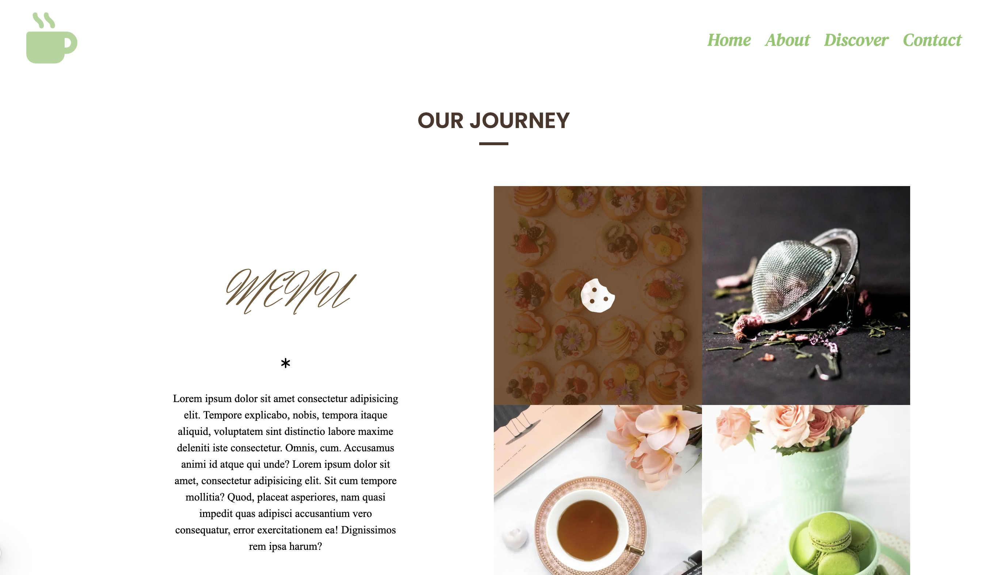
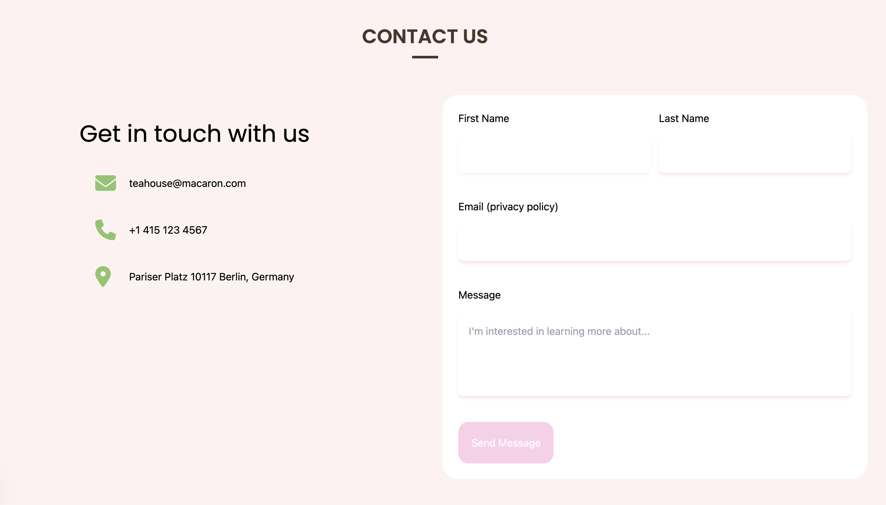

# 💻 Tea House – Digital Portfolio Website

A modern and elegant developer portfolio built with **Next.js**, **Tailwind CSS**, and **Framer Motion**.  
Designed to reflect creativity, aesthetics, and motion — just like a warm cup of tea 🍵.

---

## 🖼️ Screenshots

  
  


> 📸 You can replace screenshots in `/public/screenshots` with your own project visuals.

---

## 🌟 Features

- ✨ Animated welcome page with handwritten font
- 🧠 Smooth biography timeline and skill section
- 🎬 Seamless transitions between pages using Framer Motion
- 🖼️ Interactive image overlays with Font Awesome icons
- 💡 Clean folder structure & scalable component design
- 📱 Responsive across all devices

---

## 🛠 Tech Stack

- [Next.js](https://nextjs.org/) – React framework for SSR and routing  
- [Tailwind CSS](https://tailwindcss.com/) – Utility-first styling  
- [Framer Motion](https://www.framer.com/motion/) – Animations  
- [Font Awesome](https://fontawesome.com/) – Icon library  
- [Google Fonts](https://fonts.google.com/) – Herr Von Muellerhoff, Yellowtail, Poppins  

---

## 🚀 Getting Started

Clone and run the project locally:

```bash
git clone https://github.com/yourusername/tea-house.git
cd tea-house
npm install
npm run dev
```

> Make sure you have Node.js and npm installed.

---

## 👩‍💻 Author

Developed by **Canan Seçen Mumcu**  
[GitHub](https://github.com/canansecenmumcu) | [Portfolio](https://your-portfolio.vercel.app)

---

## 📜 License

This project is licensed under the [MIT License](LICENSE).

---

## 💬 Final Note

> "Good design is obvious. Great design is transparent." – Joe Sparano

Let your work speak for itself — one page at a time.